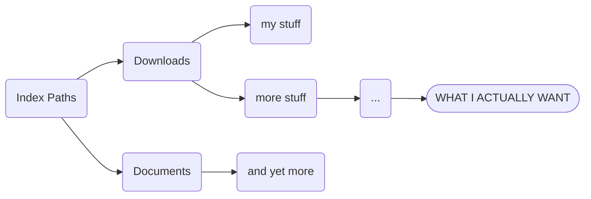

# QuickFinder _(very alpha version)_

## What is it? 
This is a simple file explorer that looks ahead in the directory tree so you can **_instantly_** search and find what you're looking for.  
No need to click your way through when you know where you're going.  
There are also some other features: 
* Sort by size, including directory sizes.  
* Full drag and drop, copy-paste compatibility with explorer.  
* File previews for images and text files. (More formats coming later.)
* QuickFinder only searches filenames, so it is actually worse at detailed search than using the normal windows file explorer, but it is **_much_** faster and starts searching as soon as you type.  It also employs fuzzy search so you can be a little wrong if you don't remember filenames exactly.  
* Instantly open explorer windows, command prompt, or WSL terminals at the location you are browsing.  
* Very simple bulk renaming.  
* ZIP functionality built in.  

***What it's not for:*** It is very bad with remote folders.  The forward scanning requires a lot of bandwidth, so unless your server is **_very_** fast or in the same room, you are better off with a normal file explorer.  

***This is not a complete replacement for file explorer.***  This is meant to work hand in hand with explorer, and offers features and navigation improvements.  Just pressing enter without a file selected will open an explorer window to that location.  

## How to install?  
Just extract the zip file into a folder and put it where you like.  It does create a data folder in your Documents folder called **"quickfinder1"** but otherwise it doesn't interfere with the operating system.  

Download here : [**quickfinder.zip**](https://github.com/pxp888/quickfinder/releases/download/v1.2.7/quickfinder.zip)

## Size Searching
The size sort feature doesn't just look at files in the current directory, it looks all the way down the file system and show the size of each directory in full.  

This can be time consuming when done on very large directories.  This is not meant to replace excellent visualization tools like Grand Perspective or Windirstat, it is only meant to give you a better view of the directory you're looking at.  

This will only work on user-accessible directories, and will skip any marked "no index" (see below)

## Tweaks
It works much faster with a little direction so it doesn't waste time on folders you aren't interested in looking at.  These are all available either by right clicking items, or through the settings window.  
#### _Index Paths_
These are paths that it should start looking at from the _homepage_.  
Once you start navigating, it only looks forward from the currently showing directory.  
Keep in mind that if one index path exists downstream of another that path will be searched twice, and results will appear twice.  

~~~mermaid
flowchart LR
ip1([Index Path 1]) --> a(...) & d(...)
w[Don't do this!] -.-> ip2
a --> ip2([Index Path 2])
ip2 --> b(...) & c(...)
d --> e(...) & f(...)
~~~

#### _No Index Paths_
These are directories that you may want to browse occasionally, but not have scanned ahead of time.  You can still browse these, but **QuickFinder** won't scan it's contents.  
#### _Excluded Paths_
These won't show up at all.  This is for places you don't want to look at.  
#### _Excluded Names_
File names that won't show up.  Useful for ignoring system files etc.  
#### _Exclude names starting with ..._
Same as above.  

